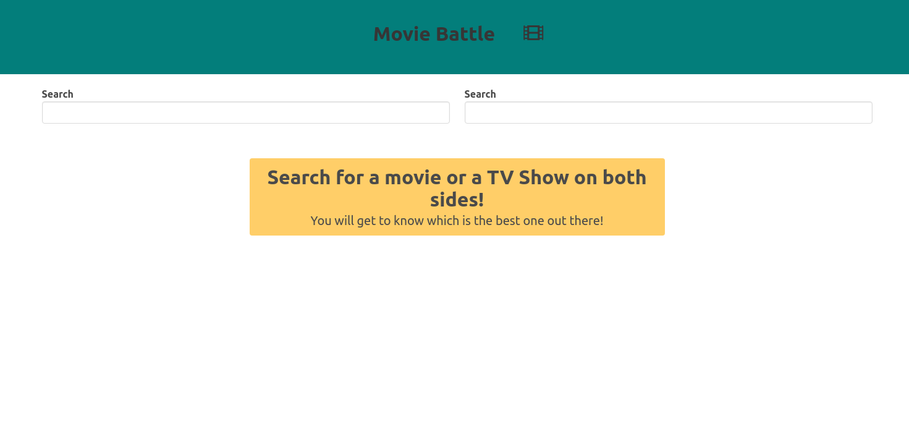
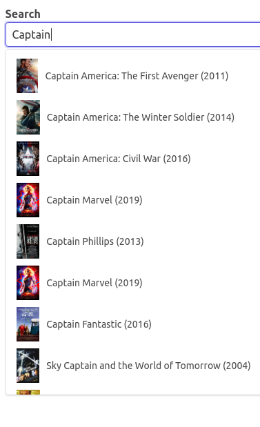
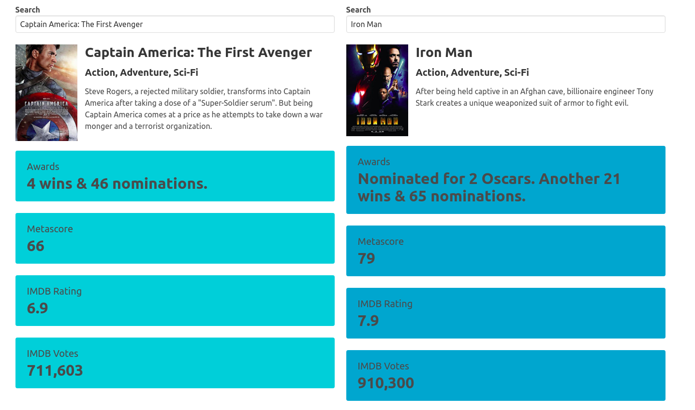

# Movie-Battle-App

This is a Movie comparison app which gives the user, statistics about the movies that are searched. Built using HTML, a CSS library called Bulma CSS and Javascript. An API called OMBb API has been used to fetch movie data.

# Key features 

1. It uses reusable code like an autocomplete widget for the Search input which can be used in other projects.
2. It fetches data from the OMDb API using the Axios library. 

# Screenshots 

